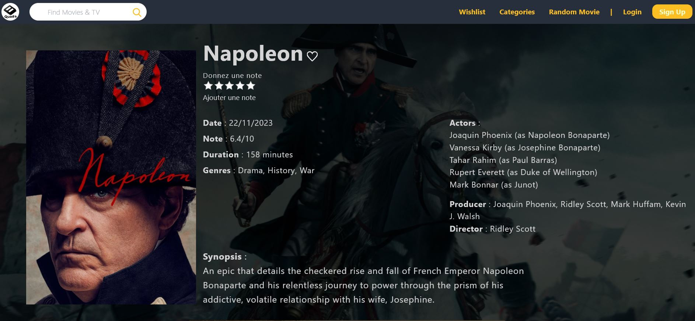

# **Quadra**

## Project Overview

The Quadra project is like a cinema website . It has a cool homepage with different sections: , **Membership** , **What's On**, **Comming Soon**...

You can log in or sign up to make your experience better.

The homepage always has a big movie at the top with info. What's cool is that it's not always the same movie; it changes each time you reload the page, so it's always fresh and CTA.

When you click on a movie, you get a whole page with lots of details. You can even rate the movie with stars: ⭐️⭐️⭐️⭐️⭐️.

You can pick movies to add to your wishlist.

We, as admins, add movies to our database and showcase them on the page. Users can subscribe and choose between basic (2 movies a month) or premium (all movies for the whole month) plans.

  

## What we used to create our website

<iframe src="https://giphy.com/embed/Bzebpz5rnyBb2" width="480" height="232" frameBorder="0" class="giphy-embed" allowFullScreen></iframe>

